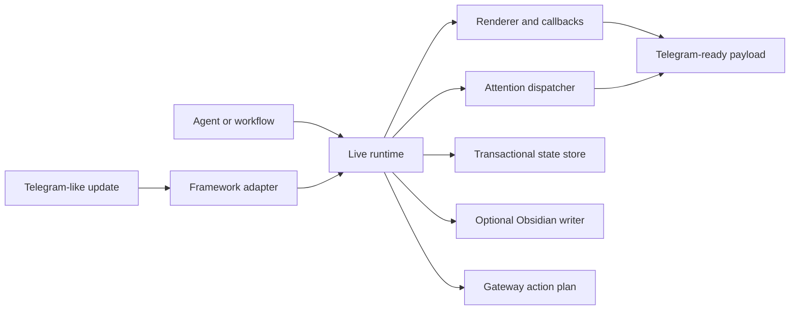

# Architecture

Hermes Companion keeps review behavior independent from Telegram polling, an AI provider, and a specific knowledge-base layout.

## Boundaries

### Domain layer

Rendering, callback semantics, attention decisions, state codecs, and runtime orchestration do not import a Telegram framework. They can be tested from plain Python dictionaries and dataclasses.

### Delivery layer

`telegram_framework_adapter.py` converts Telegram-like updates into runtime inputs. `telegram_adapter_shell.py` converts rendered messages into send/edit payloads. A concrete deployment owns polling or webhook lifecycle and credentials.

### Persistence layer

`runtime_state_store.py` uses transactional SQLite for restart recovery, idempotency, and concurrent callback serialization. `obsidian.py` is optional and writes only to an owned namespace using atomic replacement and locking.

### Gateway integration

`hermes_gateway_adapter.py` produces action plans instead of importing or controlling an installed gateway. This avoids hidden network access and prevents a second consumer from competing for Telegram updates.

## Extension points

- Replace the Telegram delivery adapter while retaining runtime behavior.
- Replace SQLite with another store behind the same decision/state contract.
- Add a knowledge-base writer with an explicit ownership namespace.
- Map another agent platform's final-result metadata to gateway action plans.
- Add organization-specific approval options without changing polling ownership.

## Non-goals

- Managing production credentials.
- Starting polling or webhook servers from the reusable core.
- Owning an entire Obsidian vault or generic knowledge-base root.
- Making autonomous business decisions without an explicit configured policy.
